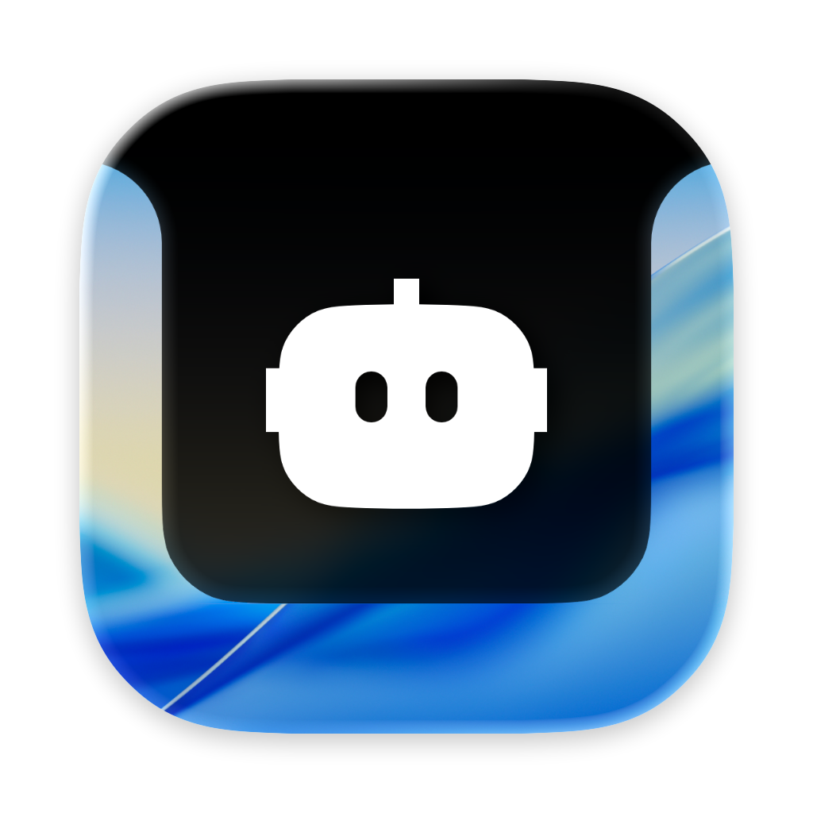

<p align="center">
  
</p>

<p align="center">
  <strong>Pester</strong>, a macOS notch app that lets coding agents get your attention.
</p>

---

Pester sits behind your MacBook's notch and expands a Dynamic Island-style notification when a coding-agent adapter needs your attention. Each bundled adapter has its own icon. Click the notification to jump to your terminal.

## Install

### Homebrew

```
brew install samkingco/tap/pester
```

### From source

```
git clone https://github.com/samkingco/pester.git
cd pester
make install
```

This builds the app, installs it to `~/Applications/Pester.app`, and configures the bundled Claude Code adapter automatically.

## How it works

```
Claude Code hooks ─┐
Pi extension ──────┼─→ neutral Pester protocol → pester-cli → Pester → notch
Future adapters ──┘
```

Communication between `pester-cli` and the app uses macOS `DistributedNotificationCenter` — no files, no polling, instant delivery. The protocol identifies the bundled adapter so Pester can select its icon.

### Claude Code adapter

The bundled Claude Code adapter uses Claude Code's [hooks system](https://docs.anthropic.com/en/docs/claude-code/hooks). Hooks are added to `~/.claude/settings.json` on install:

- `PermissionRequest` → `pester-cli claude set`
- `Notification` → `pester-cli claude set`
- `PostToolUse` → `pester-cli claude clear`
- `Stop` → `pester-cli claude clear`

### Pi adapter

The Pi adapter is a global Pi extension in the [agents repository](https://github.com/samkingco/agents). It gives every Pi agent a `pester` tool. The agent uses the tool to arm a notification, and the extension sends it after Pi emits `agent_settled`.

```sh
agents extensions install pester
```

## Config

Click the menu bar icon to access:

- **Sound** — pick from macOS system sounds or turn off
- **Pester Tester** — trigger a fake notification with a bundled adapter
- **Clear All** — dismiss all pending notifications

Sound preference is saved to `~/.pester/config.json`.

## Terminal

Defaults to [Ghostty](https://ghostty.org). To change, edit `terminalBundleId` in `Sources/Pester/Constants.swift` and rebuild.

## Requirements

- macOS 14+
- MacBook with notch
- A supported coding-agent adapter, currently Claude Code or Pi

## Uninstall

```
make uninstall
```

Remove the hooks from `~/.claude/settings.json` manually, and optionally `rm -rf ~/.pester`.
